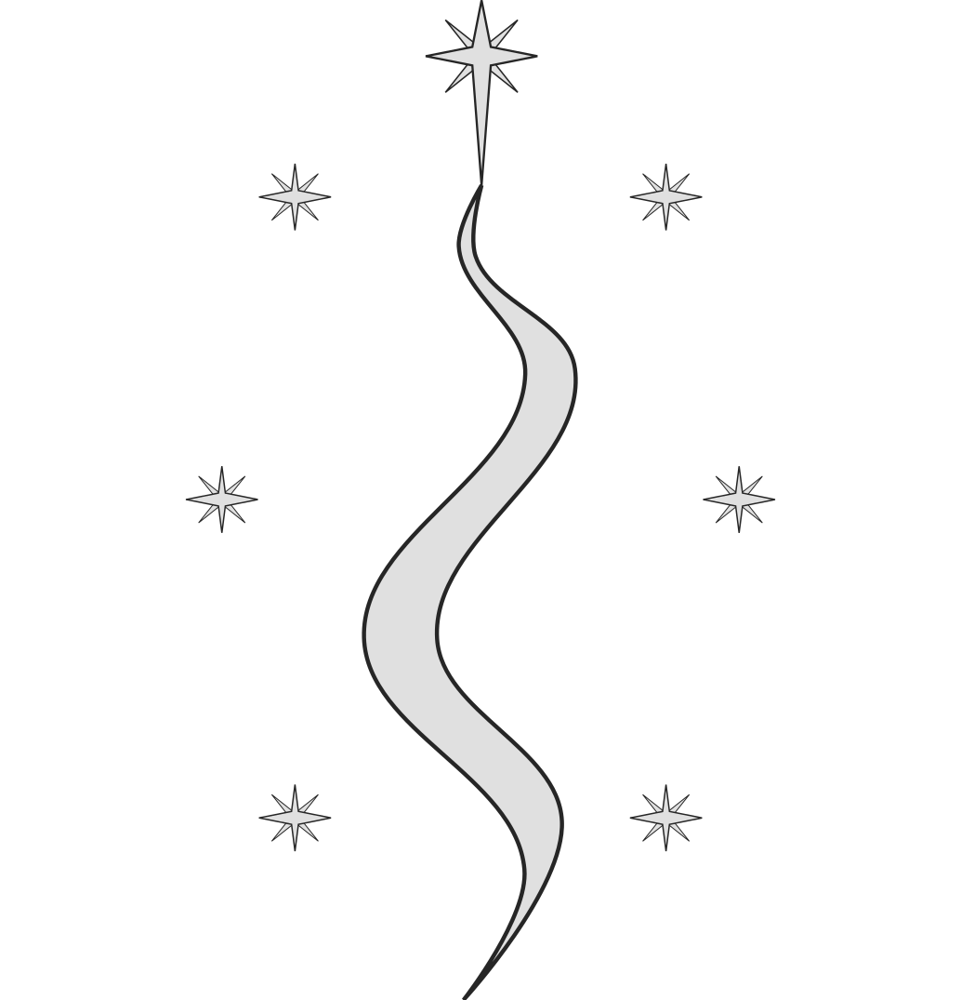

# Elven pantheon

{ width=150; align=right }

## Aranwel
<!-- aran gwelu -->

<small>
*edh.*  / aranwel / 7E5#yj$  
</small>

**Aranwel** is a god associated with weather and raw power of nature.

**Follower Alignments**: NG, LN, N, CN, NE

??? info "Devotee Benefits"
    **Divine Ability**: Strength or Wisdom  
    **Divine Font**: Harm/Heal  
    **Divine Skill**: Nature  
    **Favored Weapon**: Spear  
    **Domains**: [Air](https://2e.aonprd.com/Domains.aspx?ID=2), [Cold](https://2e.aonprd.com/Domains.aspx?ID=41), [Lightning](https://2e.aonprd.com/Domains.aspx?ID=47), [Might](https://2e.aonprd.com/Domains.aspx?ID=20)  
    **Alternate Domains**: [Cold](https://2e.aonprd.com/Domains.aspx?ID=41), [Water](https://2e.aonprd.com/Domains.aspx?ID=35)  
    <!-- **Cleric Spells**: 1st: [*mage armor*](https://2e.aonprd.com/Spells.aspx?ID=176) -->

{ width=150; align=right }

## Gildir

<small>
*edh.*  / gildir / xj%26T  
</small>

**Gildir** is a god associated with moon. God of night air and freedom of nature.

**Follower Alignments**: CG, N, CN, CE

??? info "Devotee Benefits"
    **Divine Ability**: Dexterity or Charisma  
    **Divine Font**: Harm/Heal  
    **Divine Skill**: Survival  
    **Favored Weapon**: Elven khopesh  
    **Domains**: [Freedom](https://2e.aonprd.com/Domains.aspx?ID=14), [Moon](https://2e.aonprd.com/Domains.aspx?ID=21), [Star](https://2e.aonprd.com/Domains.aspx?ID=52), [Travel](https://2e.aonprd.com/Domains.aspx?ID=30)  
    **Alternate Domains**: [Change](https://2e.aonprd.com/Domains.aspx?ID=40), [Luck](https://2e.aonprd.com/Domains.aspx?ID=18)  
    <!-- **Cleric Spells**: 1st: [*mage armor*](https://2e.aonprd.com/Spells.aspx?ID=176) -->

{ width=150; align=right }

## Ungorian

<small>
*edh.*  / uŋorian / b&7Y`B5#  
</small>

**Follower Alignments**: CN, NE, CE

**Ungorian** (or **Lolz** in Ñiziel) known as the Queen of Spiders. She is the most influential deamon-goddess of the drow.

It is believed that **Ungorian** was once great elven goddess **Lothrien** the Queen of Blossom before she fell to corruption and evil.

??? info "Devotee Benefits"
    **Divine Ability**: Intelligence or Charisma  
    **Divine Font**: Harm  
    **Divine Skill**: Deception  
    **Favored Weapon**: Spider (dagger)  
    **Domains**: [Darkness](https://2e.aonprd.com/Domains.aspx?ID=6), [Secrecy](https://2e.aonprd.com/Domains.aspx?ID=28), [Swarm](https://2e.aonprd.com/Domains.aspx?ID=53), [Trickery](https://2e.aonprd.com/Domains.aspx?ID=31), [Zeal](https://2e.aonprd.com/Domains.aspx?ID=37)  
    **Alternate Domains**: [Destruction](https://2e.aonprd.com/Domains.aspx?ID=8), [Passion](https://2e.aonprd.com/Domains.aspx?ID=25)  
    <!-- **Cleric Spells**: 1st: [*mage armor*](https://2e.aonprd.com/Spells.aspx?ID=176) -->
